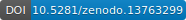

================================
LabInform datasafe documentation
================================

*A local repository for "warm" research data.*

Welcome! This is the documentation for the LabInform datasafe component, the **local repository for "warm" research data** that is part of the `LabInform laboratory information and management system <https://www.labinform.de/>`_ (LIMS). One key aspect of handling data is to safely store them in one place and access them via **unique and stable identifiers** (here: a *Lab Object Identifier*, LOI). While data belonging to (textual) publications can often be stored in public repositories, we need a safe place for all our (unpublished) data, starting with their acquisition and independent of their current state. This is meant by "warm" research data -- a term coined by `scientists from KIT <https://doi.org/10.5334/dsj-2021-008>`_.

Features
========

A list of features, not all implemented yet but aimed at for the first public release:

* Repository for "warm" research data: one central place

* Access to data using unique and persistent IDs (*Lab Object Identifier*, LOI)

* Client-server architecture, supporting local and network operation

* Full control over the data: runs locally on your own hardware

* Automatic generation of unique IDs for data

* Pre-register IDs before starting the data acquisition.

* Checksums for automatically checking data integrity

And to make it even more convenient for users and future-proof:

* Open source project written in Python (>= 3.9)

* Developed fully test-driven

* Extensive user and API documentation

.. warning::
  The LabInform datasafe component is currently under active development and still considered in Beta development state. Therefore, expect frequent changes in features and public APIs that may break your own code. Nevertheless, feedback as well as feature requests are highly welcome.

Requirements
============

The LabInform datasafe package comes with a rather minimal set of requirements:

* Python >= 3.9
* flask and oyaml packages

.. _sec-how_to_cite:

How to cite
===========

The LabInform datasafe is free software. However, if you use the LabInform datasafe as crucial infrastructure component of your own research, please cite the software:

* Mirjam Schröder, Till Biskup. LabInform datasafe (2023). doi:10.5281/zenodo.13763299

To make things easier, the LabInform datasafe has a `DOI <https://doi.org/10.5281/zenodo.13763299>`_ provided by `Zenodo <https://zenodo.org/>`_, and you may click on the badge below to directly access the record associated with it. Note that this DOI refers to the software as such and always forwards to the most current version.

Where to start
==============

If you want to know what it is all about or are unsure whether the LabInform datasafe is interesting for you, start :doc:`right at the beginning <audience>`. Other good places to start are the :doc:`concepts` and :doc:`usecases` sections. If you are interested in contributing to the LabInform datasafe, the :doc:`developers corner <contribute>` is the right place for you.

Installation
============

To install the LabInform datasafe package on your computer (sensibly within a Python virtual environment), open a terminal (activate your virtual environment), and type in the following:

.. code-block:: bash

    pip install labinform-datasafe

Have a look at the more detailed :doc:`installation instructions <installing>` as well.

Related projects
================

There is a number of related packages users of the LabInform datasafe may well be interested in, as they have a similar scope, focussing on spectroscopy and reproducible research.

* `ASpecD <https://docs.aspecd.de/>`_

  A Python framework for the analysis of spectroscopic data focussing on reproducibility and good scientific practice.

.. toctree::
   :maxdepth: 2
   :caption: User manual:
   :hidden:

   audience
   introduction
   concepts
   usecases
   installing

.. toctree::
   :maxdepth: 2
   :caption: Developers:
   :hidden:

   people
   contribute
   changelog
   roadmap
   api/index

License
=======

This program is free software: you can redistribute it and/or modify it under the terms of the **BSD License**. However, if you use the LabInform datasafe as crucial infrastructure component of your own research, please cite it appropriately. See :ref:`How to cite <sec-how_to_cite>` for details.

A note on the logo
==================

The "L" of the LabInform logo originates from the Computer Modern Roman font originally designed by Donald E. Knuth for his TeX typesetting system. As such, it represents science and the scientific method. Harbouring the "i" representing the information bit puts things right: Proper and reproducible science is the solid support for all the information we can retrieve. The copyright of the LabInform logo belongs to J. Popp. The added symbol on the bottom right is taken from FontAwesome.
